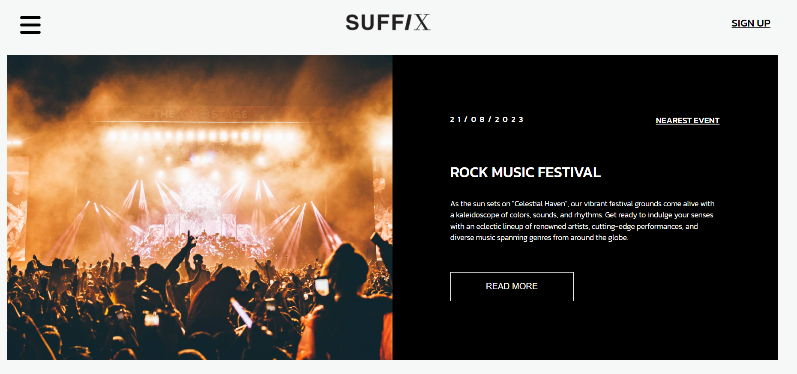
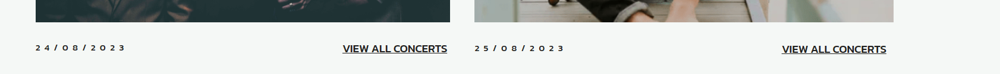

Welcome to the Suffix Music Platform! This web application is designed to be a one-stop destination for music enthusiasts to explore, discover, and connect with a diverse community of creators from around the world.

## Features 

Discover the Finest Music: Immerse yourself in a vast selection of music genres, from trending tracks to hidden gems and everything in between. Suffix curates a collection that caters to all musical tastes.

- __Navigation Bar__

    - Navigation bar includes links to the Home page, About Us and Sign Up page and is identical in each page to allow for easy navigation. 
    - This section will allow the user to easily navigate from page to page across all devices without having to revert back to the previous page via the ‘back’ button.

- __Striking Visuals__

    - Upon entering the landing page, users are greeted with a vibrant collage of musical instruments, artists performing on stage, and people enjoying music, instantly capturing the user's attention and setting the tone for an exciting adventure.

- __Clear Call-to-Action__
    - Right a prominent call-to-action (CTA) button encourages visitors to "Read more" and "Nearest event". The CTA stands out with its contrasting color and directs users to dive deeper into the platform, enticing them to explore the diverse musical content that awaits.  

- __Featured Content__

    - As users scroll down the landing page, they encounter a curated selection of featured content, showcasing trending tracks, recent releases, and emerging talent. This section entices users to explore more by offering a taste of the rich and diverse musical content available on the platform.  
    

- __The About us Page__

    - The "About Us" page of the Suffix Music Platform provides a captivating insight into the platform's mission, vision, and the visionary team behind it. It narrates the platform's journey, emphasizing its commitment to fostering creativity, discovery, and authentic connections within the global music community. 
    - In addition, the "About Us" page features interactive videos. 

- __The Sign Up Page__

    - The "Sign Up" page of the Suffix Music Platform offers users a seamless and user-friendly registration process, allowing them to become part of the dynamic music community. The page presents a simple and intuitive form where users can enter their essential details, such as name, email address, and password, to create a new account on the platform.

## Future features
In the future, we plan to introduce several interesting features that will improve the user experience on the Suffix website:

1. A "READ MORE" button for more information about the festival:  
The button in the first section of the site will display a pop-up window with detailed information about the festival. This window will contain the festival poster, description, address, schedule, ticketing information, gallery, sponsors, list of upcoming festivals and concerts and much more. Users will be able to get a complete picture of the festival without leaving the main page of the site.

2. "VIEW ALL CONCERTS" Link:  
List of upcoming festivals and concerts to provide a broader view of the featured musical group's performances. This link will lead users to a dedicated page where they can explore the group's upcoming tour dates, cities, and countries they will be performing in. Additionally, users can read more about the group, listen to their music, and purchase tickets for any of the listed concerts.

3. "SEE ALL EVENTS" page with sorting option:
Easy navigation is very important when searching for specific events. Therefore, in the future we are planning a comprehensive "See all events" page, which will contain a database of all events presented on the site. Users will be able to sort by date, event name, popularity, price, etc. This will allow them to quickly find events that match their preferences.  

4. A detailed "SEE ALL INTERVIEW" and "SEE ALL NEWS" sections:
By clicking on this link users will have access to a database containing interviews and news articles related to the band and other events discussed. The sorting options can be used to find interviews or news articles of interest.

## Testing 

- I tested that this page works in different browsers: Chrome, Firefox, Safari.
- Project is responsive, looks good and functions on all standard screen sizes using the devtools device toolbar.
- Navigation, header, about us, sign up,and home page are all readable and easy to understand.
- The form works: requires entries in every field, will only accept an email in the email field, and the submit button works.

### Validator Testing 

- HTML
  - No errors were returned when passing through the official [W3C validator](https://validator.w3.org/nu/?doc=https%3A%2F%2Fcode-institute-org.github.io%2Flove-running-2.0%2Findex.html)
- CSS
  - No errors were found when passing through the official [(Jigsaw) validator](https://jigsaw.w3.org/css-validator/validator?uri=https%3A%2F%2Fvalidator.w3.org%2Fnu%2F%3Fdoc%3Dhttps%253A%252F%252Fcode-institute-org.github.io%252Flove-running-2.0%252Findex.html&profile=css3svg&usermedium=all&warning=1&vextwarning=&lang=en#css)
- Accessibility
    - I confirmed that the colors and fonts chosen are easy to read and accessible by running it through lighthouse in devtools  

## Languages Used

- HTML5
- CSS3

## Deployment 

- The site was deployed to GitHub pages. The steps to deploy are as follows: 
  - In the GitHub repository, navigate to the Settings tab 
  - From the source section drop-down menu, select the Master Branch
  - Once the master branch has been selected, the page will be automatically refreshed with a detailed ribbon display to indicate the successful deployment. 

## Credits 

### Content 

- The text for the Home page was taken from [Songkick](https://www.songkick.com/festivals/countries/ie), music bands and dates of their concerts were invented by me.
- The icons in the footer were taken from [Font Awesome](https://fontawesome.com/)
- A piece of code, namely the form on the Sign Up page, was taken from the Love Running training project, but was adapted to my design and needs

### Media

- The photos used on the home and sign up page are from This Open Source site
- The images used for the gallery page were taken from this other open source site and [Pexels](https://www.pexels.com/)

